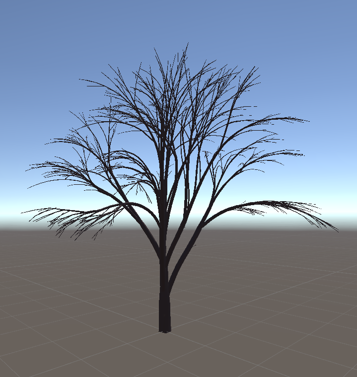
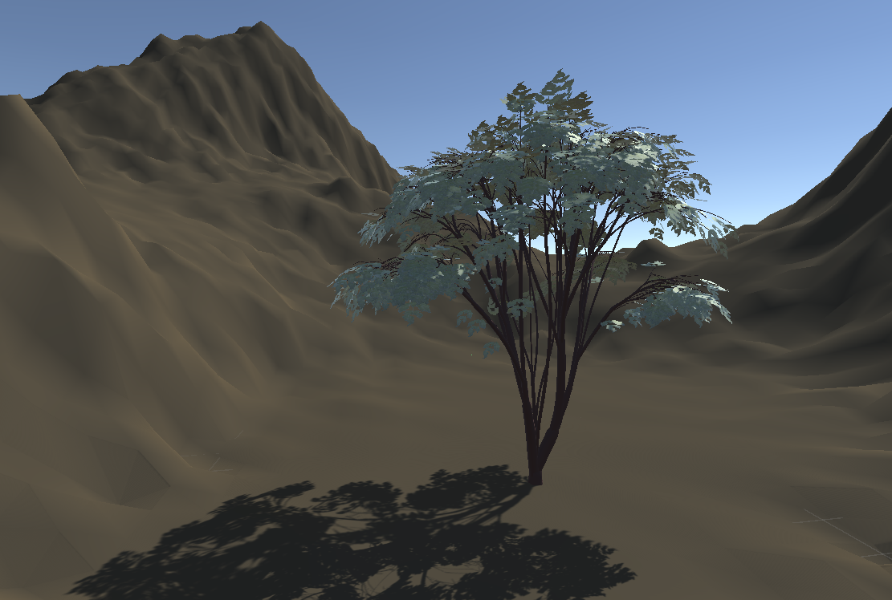
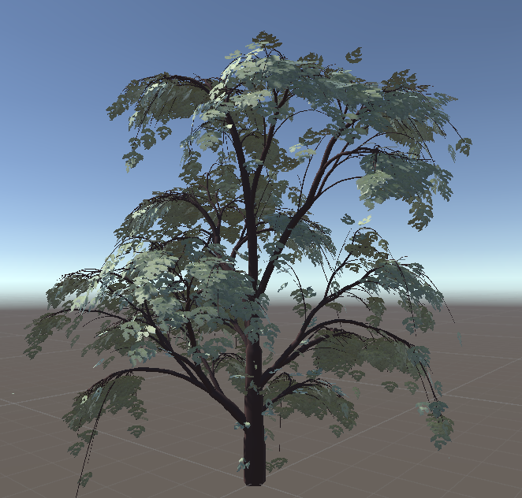
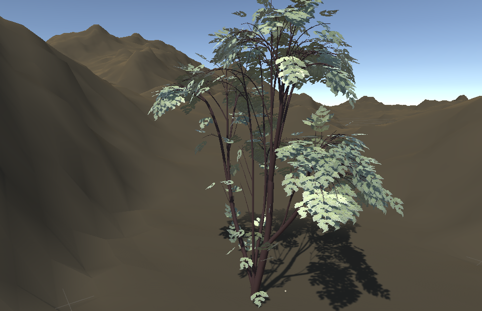

本项目是一个基于植物自我组织生长原理的模拟系统，通过程序化生成的方式模拟植物在不同环境条件下的生长过程。系统核心算法参照[Wojciech Palubicki, Kipp Horel, Steven Longay, Adam Runions, Brendan Lane, Radomír Měch, and Przemyslaw Prusinkiewicz. 2009. Self-organizing tree models for image synthesis. In ACM SIGGRAPH 2009 papers (SIGGRAPH '09), Hugues Hoppe (Ed.). ACM, New York, NY, USA, Article 58.](https://doi.org/10.1145/1531326.1531364)，实现了植物在光照、 tropism（向性）等环境因素影响下的自然生长模拟。

    <em>图1: 树的枝干</em> 

    <em>图2: 不同参数组合的树(1)</em> 

    <em>图3: 不同参数组合的树(2)</em> 

    <em>图4: 不同参数组合的树(3)</em> 
